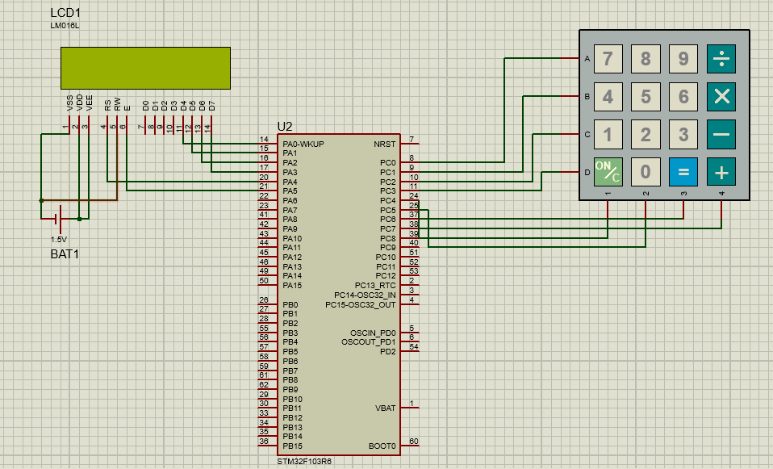
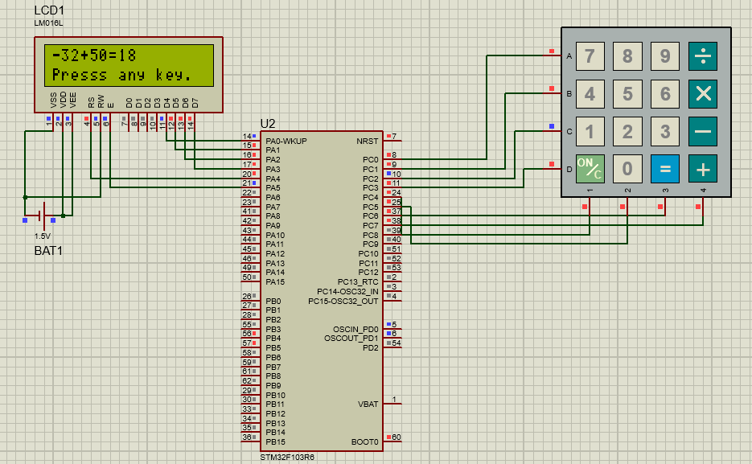

# STM32 Bare-Metal Calculator (Proteus Simulation)

A calculator implemented on STM32F103C8T6 (Blue Pill) using direct register-level programming (Bare-Metal).

## Features

- Bare-Metal STM32 programming
- 4x4 Keypad Interface
- 16x2 LCD Display
- Addition
- Subtraction
- Multiplication
- Division
- Proteus Simulation

## Hardware

- STM32F103C8T6 (Blue Pill)
- 4x4 Keypad
- 16x2 LCD

## Software Tools

- Embedded C
- Keil uVision
- Proteus

## Project Status

This project was developed and validated in the Proteus simulation environment.

## Circuit

## Result

## Author

Arian Chenari
